# Outer Horizon
## Global Solution 2026.1 — Cross-Platform Application Development | FIAP
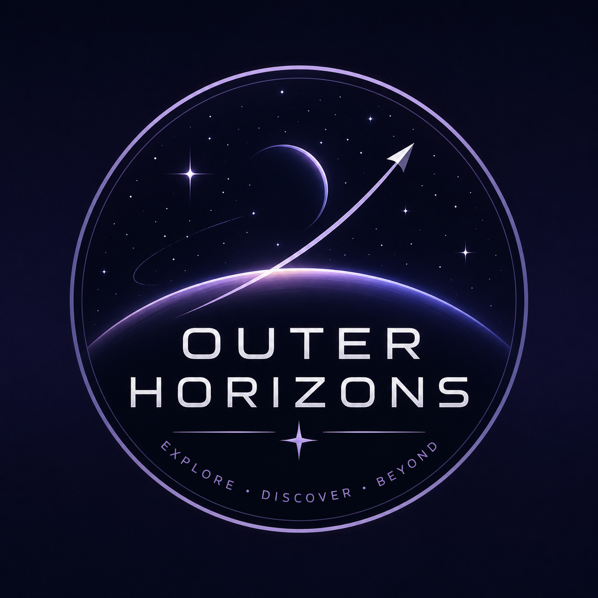
 
O Outer Horizon é um app de monitoramento e gerenciamento para agências espaciais. O app permite verificar missões espaciais em andamento, agendar missões, verficar atributos dos satélites envolvidos nas missões e filtrar por planeta, além disso, o aplicativo também permite verificar dados de pesquisa recolhidos pelos satélites de científicos, e por fim por meio de um algoritmo interno, são gerados sugestões de tomadas de decisões em caso de dados críticos recolhidos pelos aparelhos ou em caso de falha dos em alguma função dos satélites
## Equipe
 
| Nome | RM |
|------|----|
| Diego Antonio Silva Mendes | RM565509 |
| Israel Karacsony de Camargo Nunes | RM563435 |
 
## Telas do Aplicativo
 
### Login — Tela inicial|
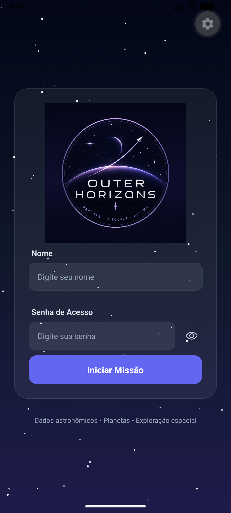

Tela para acessar as diferentes contas cadastradas no sistema (Para saber como, acesse o arquivo `../data/logins.js` )

### Mapa do sistema solar interativo
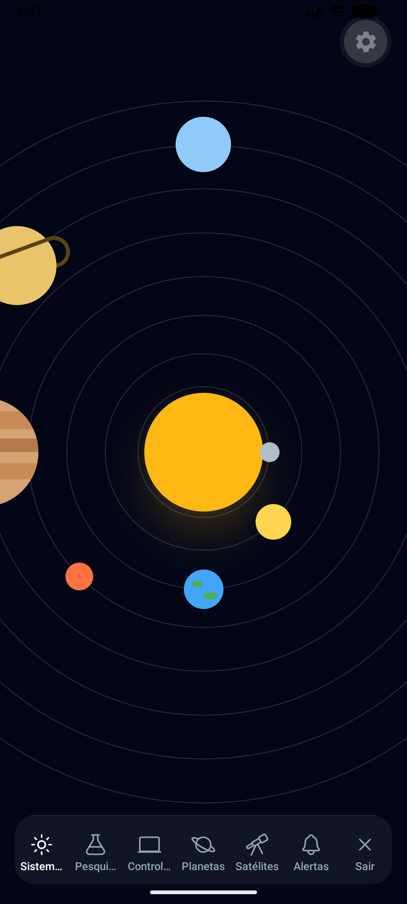

Um mapa simulado do sistema solar que é interativo ao clicar em cada planeta

### Dashboard dos dados - Pesquisa 
| 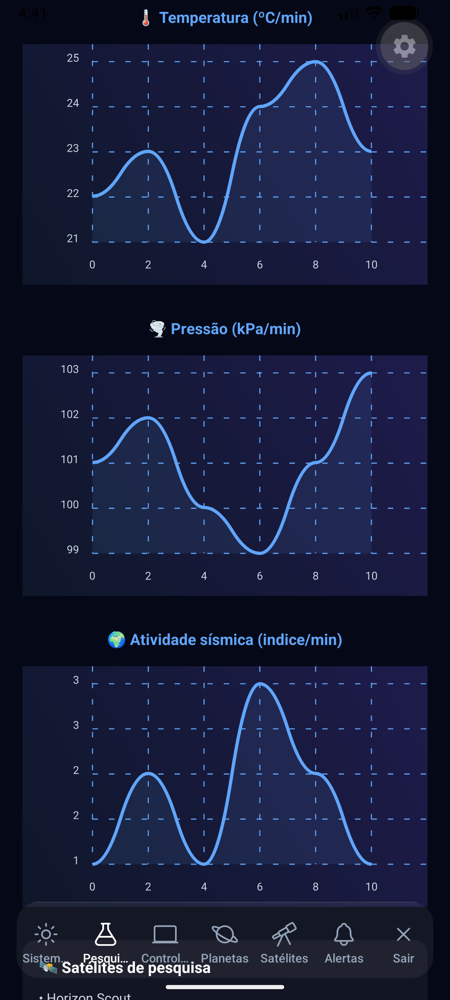 | 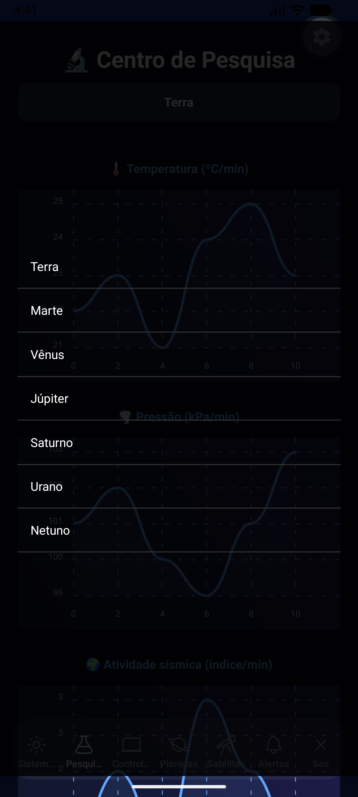

Gráficos de linha com leituras dos sensores dos satélites em tempo real simulado e status dos links de telemetria.

### Dashboard das missões - Controle de missão

| Área de monitoramento das missões cadastradas | Formulário de cadastro de missões | Feedback de erro de formulário
| 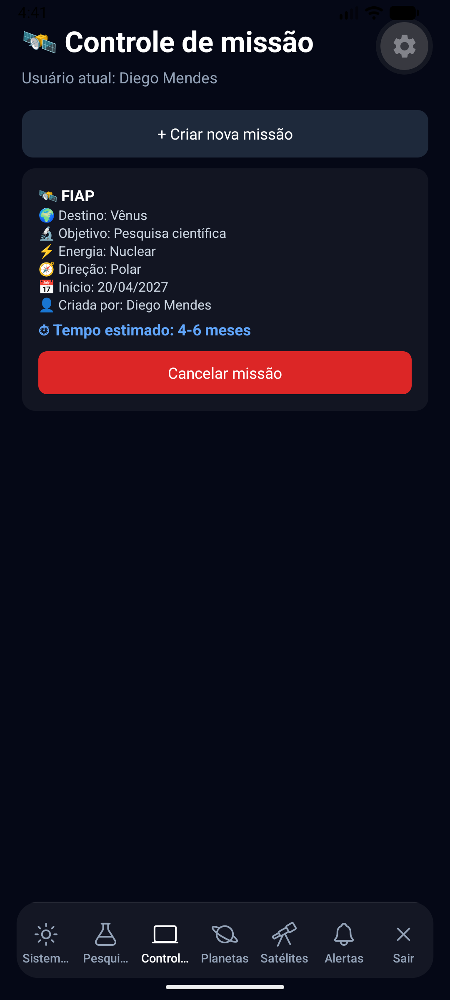 | 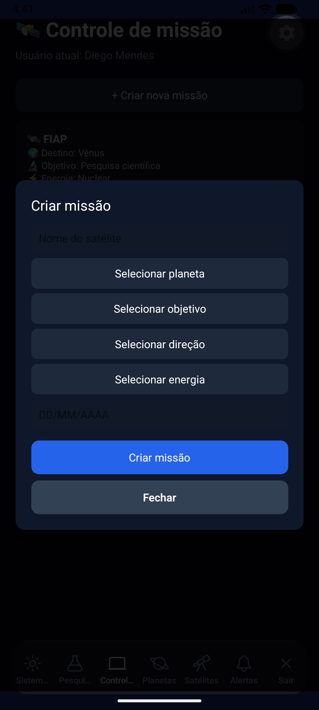 | 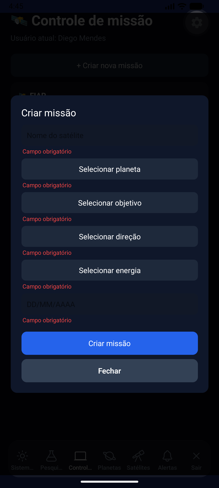

Dashboard para visualizações e cadastros das missões agendadas pelo usuário

### Informações dos planetas - Planetas

| 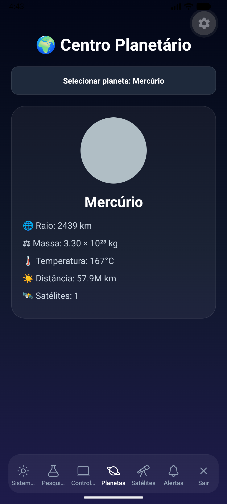 | 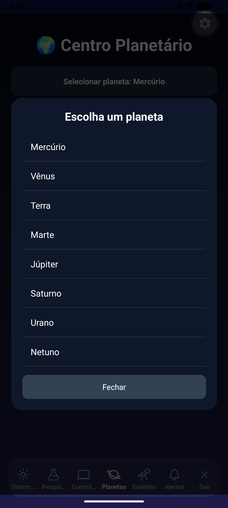

Tela informativa sobre alguns dados básicos dos planetas do sistema solar

### Dashboard de satélites - Satélites

| 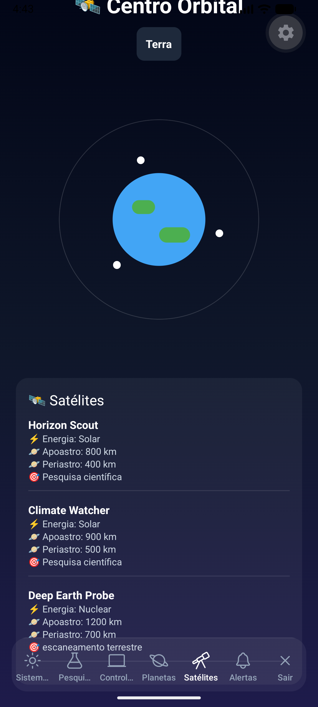 | 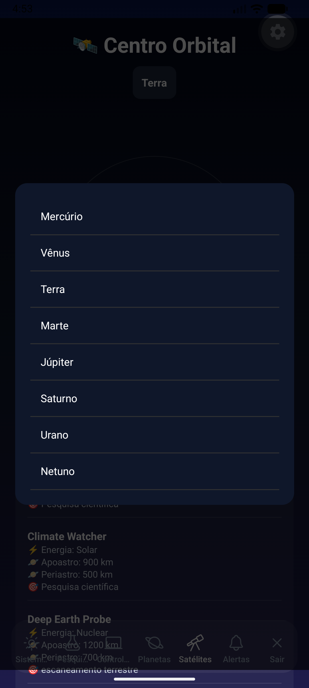

Dashboard principal que exibe informações de todas as missões em progresso ou agendadas, filtradas por planeta de destino

### Página de alertas - Alertas

| 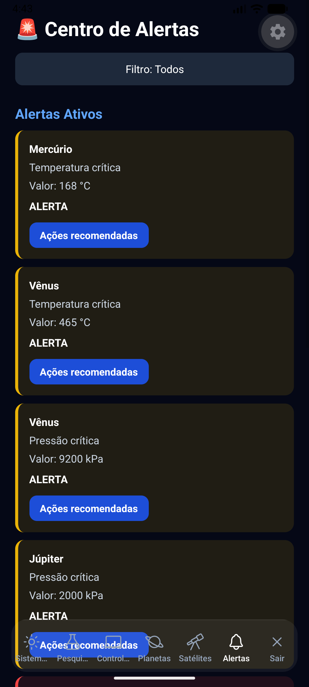 | 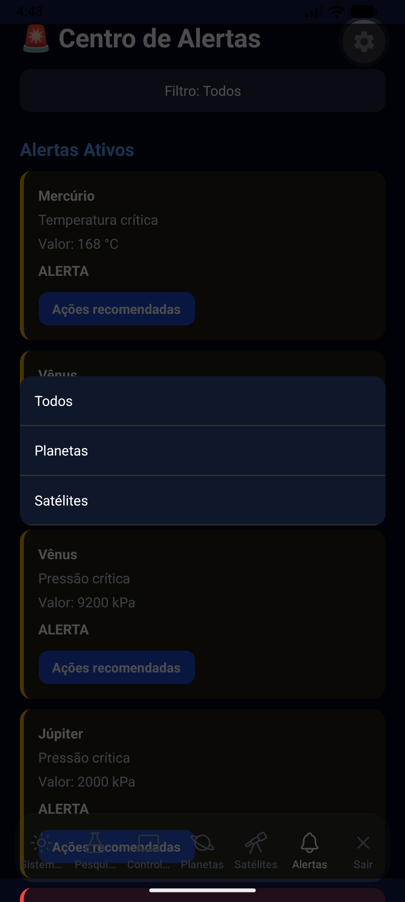

Página com algoritmo preditivo de limiares críticos que gera um alerta caso algum possa ser danoso ao satélite, sugerindo uma tomada de decisão automatizada

### Tela de logout - Logout
| 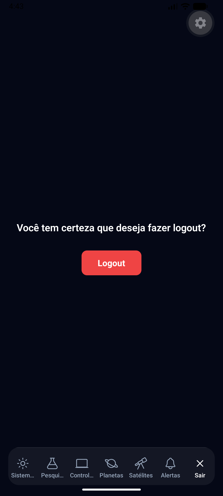 |

Página simples para o usuário deslogar de sua conta e retornar a tela inicial

## Funcionalidades
 
  [x] Dashboard com indicadores e gráficos em tempo real (simulado)
 
  [x] Sistema de alertas automáticos por limiar crítico
  
  [x] Persistência de configurações de missão com AsyncStorage
  
  [x] Navegação com Expo Router (Tabs + Stack)
  
  [x] Context API para estado global da missão
  
  [x] Formulário de configuração com validação
 
## Tecnologias
 
  - React Native + Expo
  - Expo Router
  - AsyncStorage
  - Context API
  - JavaScript (se aplicável)
  - Expo Linear Gradient
  - Ionicons
  - React Native Chart Kit
  - React Native SVG
  - Reanimated
 
## Como Executar
 
### Pré-requisitos
  - Node.js instalado
  - Expo CLI: `npm install -g expo-cli`
  - Expo Go instalado no celular (iOS ou Android)
### Como instalar e acessar
  - Digite no terminal: `git clone https://github.com/Dimeendes/Outer-Horizon.git` 
  - Acesse a pasta do projeto com: `cd Outer-Horizon` (ou o nome selecionadom para a pasta)
  - Digite no terminal: `npx expo start`
  - Escaneie o QR Code com o Expo Go para rodar no dispositivo físico.

## Vídeo de Demonstração

[Clique aqui para assistir à demonstração](https://drive.google.com/file/d/1TUpyv91QspLKk8N3bAvlTzQ6gYfIQHB8/view?usp=sharing)

## Licença
Este projeto foi desenvolvido para fins acadêmicos — FIAP 2026.
